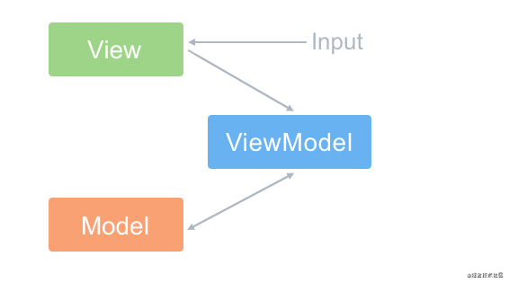
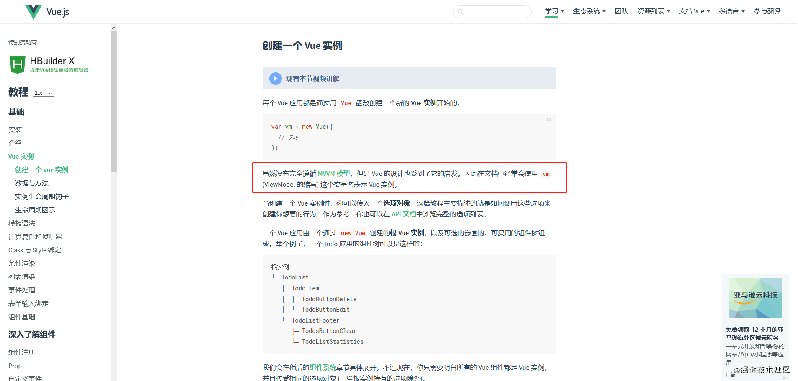
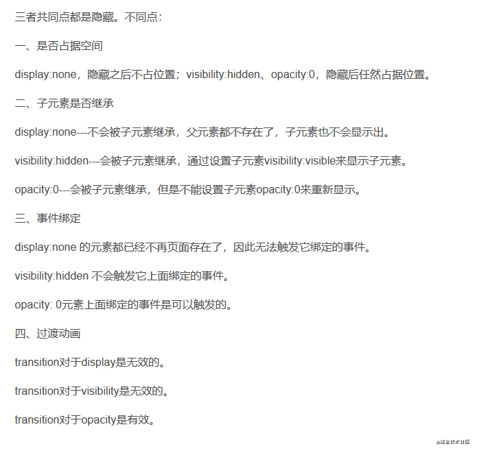
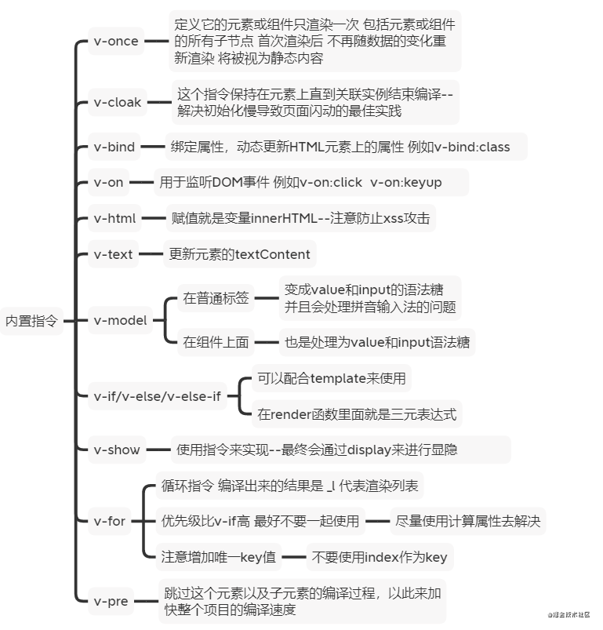
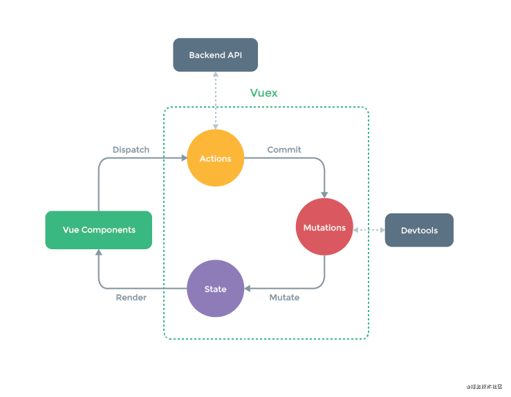
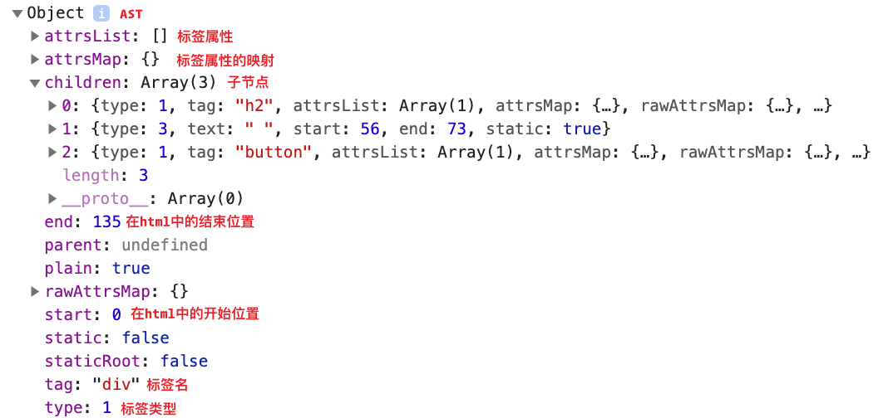

# vue面试题
## 简单
### 1 MVC 和 MVVM 区别
- MVC
MVC 全名是 Model View Controller，是模型(model)－视图(view)－控制器(controller)的缩写，一种软件设计典范

1. Model（模型）：是应用程序中用于处理应用程序数据逻辑的部分。通常模型对象负责在数据库中存取数据
2. View（视图）：是应用程序中处理数据显示的部分。通常视图是依据模型数据创建的
3. Controller（控制器）：是应用程序中处理用户交互的部分。通常控制器负责从视图读取数据，控制用户输入，并向模型发送数据


MVC 的思想：一句话描述就是 Controller 负责将 Model 的数据用 View 显示出来，换句话说就是在 Controller 里面把 Model 的数据赋值给 View。
- MVVM

MVVM 新增了 VM 类

1. ViewModel 层：做了两件事达到了数据的双向绑定 

一是将【模型】转化成【视图】，即将后端传递的数据转化成所看到的页面。实现的方式是：数据绑定。二是将【视图】转化成【模型】，即将所看到的页面转化成后端的数据。实现的方式是：DOM 事件监听。



MVVM 与 MVC 最大的区别就是：它实现了 View 和 Model 的自动同步，也就是当 Model 的属性改变时，我们不用再自己手动操作 Dom 元素，来改变 View 的显示，而是改变属性后该属性对应 View 层显示会自动改变（对应Vue数据驱动的思想）

整体看来，MVVM 比 MVC 精简很多，不仅简化了业务与界面的依赖，还解决了数据频繁更新的问题，不用再用选择器操作 DOM 元素。因为在 MVVM 中，View 不知道 Model 的存在，Model 和 ViewModel 也观察不到 View，这种低耦合模式提高代码的可重用性

注意：Vue 并没有完全遵循 MVVM 的思想 这一点官网自己也有说明



那么问题来了 为什么官方要说 Vue 没有完全遵循 MVVM 思想呢？


严格的 MVVM 要求 View 不能和 Model 直接通信，而 Vue 提供了$refs 这个属性，让 Model 可以直接操作 View，违反了这一规定，所以说 Vue 没有完全遵循 MVVM。


### 2 为什么 data 是一个函数
组件中的 data 写成一个函数，数据以函数返回值形式定义，这样每复用一次组件，就会返回一份新的 data，类似于给每个组件实例创建一个私有的数据空间，让各个组件实例维护各自的数据。而单纯的写成对象形式，就使得所有组件实例共用了一份 data，就会造成一个变了全都会变的结果
### 3 Vue 组件通讯有哪几种方式


props 和$emit 父组件向子组件传递数据是通过 prop 传递的，子组件传递数据给父组件是通过$emit 触发事件来做到的


$parent,$children 获取当前组件的父组件和当前组件的子组件


$attrs 和$listeners A->B->C。Vue 2.4 开始提供了$attrs 和$listeners 来解决这个问题


父组件中通过 provide 来提供变量，然后在子组件中通过 inject 来注入变量。(官方不推荐在实际业务中使用，但是写组件库时很常用)


$refs 获取组件实例


envetBus 兄弟组件数据传递 这种情况下可以使用事件总线的方式


vuex 状态管理


### 4 Vue 的生命周期方法有哪些 一般在哪一步发请求
beforeCreate 在实例初始化之后，数据观测(data observer) 和 event/watcher 事件配置之前被调用。在当前阶段 data、methods、computed 以及 watch 上的数据和方法都不能被访问
created 实例已经创建完成之后被调用。在这一步，实例已完成以下的配置：数据观测(data observer)，属性和方法的运算， watch/event 事件回调。这里没有$el,如果非要想与 Dom 进行交互，可以通过 vm.$nextTick 来访问 Dom
beforeMount 在挂载开始之前被调用：相关的 render 函数首次被调用。
mounted 在挂载完成后发生，在当前阶段，真实的 Dom 挂载完毕，数据完成双向绑定，可以访问到 Dom 节点
beforeUpdate 数据更新时调用，发生在虚拟 DOM 重新渲染和打补丁（patch）之前。可以在这个钩子中进一步地更改状态，这不会触发附加的重渲染过程
updated 发生在更新完成之后，当前阶段组件 Dom 已完成更新。要注意的是避免在此期间更改数据，因为这可能会导致无限循环的更新，该钩子在服务器端渲染期间不被调用。
beforeDestroy 实例销毁之前调用。在这一步，实例仍然完全可用。我们可以在这时进行善后收尾工作，比如清除计时器。
destroyed Vue 实例销毁后调用。调用后，Vue 实例指示的所有东西都会解绑定，所有的事件监听器会被移除，所有的子实例也会被销毁。 该钩子在服务器端渲染期间不被调用。
activated keep-alive 专属，组件被激活时调用
deactivated keep-alive 专属，组件被销毁时调用

异步请求在哪一步发起？

可以在钩子函数 created、beforeMount、mounted 中进行异步请求，因为在这三个钩子函数中，data 已经创建，可以将服务端端返回的数据进行赋值。
如果异步请求不需要依赖 Dom 推荐在 created 钩子函数中调用异步请求，因为在 created 钩子函数中调用异步请求有以下优点：

能更快获取到服务端数据，减少页面  loading 时间；
ssr  不支持 beforeMount 、mounted 钩子函数，所以放在 created 中有助于一致性；

### 5 v-if 和 v-show 的区别
v-if 在编译过程中会被转化成三元表达式,条件不满足时不渲染此节点。
v-show 会被编译成指令，条件不满足时控制样式将对应节点隐藏 （display:none）
使用场景
v-if 适用于在运行时很少改变条件，不需要频繁切换条件的场景
v-show 适用于需要非常频繁切换条件的场景

扩展补充：display:none、visibility:hidden 和 opacity:0 之间的区别？



### 6 说说 vue 内置指令


### 7 怎样理解 Vue 的单向数据流
数据总是从父组件传到子组件，子组件没有权利修改父组件传过来的数据，只能请求父组件对原始数据进行修改。这样会防止从子组件意外改变父级组件的状态，从而导致你的应用的数据流向难以理解。

注意：在子组件直接用 v-model 绑定父组件传过来的 prop 这样是不规范的写法 开发环境会报警告

如果实在要改变父组件的 prop 值 可以再 data 里面定义一个变量 并用 prop 的值初始化它 之后用$emit 通知父组件去修改
### 8 computed 和 watch 的区别和运用的场景
computed 是计算属性，依赖其他属性计算值，并且 computed 的值有缓存，只有当计算值变化才会返回内容，它可以设置 getter 和 setter。
watch 监听到值的变化就会执行回调，在回调中可以进行一些逻辑操作。
计算属性一般用在模板渲染中，某个值是依赖了其它的响应式对象甚至是计算属性计算而来；而侦听属性适用于观测某个值的变化去完成一段复杂的业务逻辑
计算属性原理详解 传送门
侦听属性原理详解 传送门
### 9 v-if 与 v-for 为什么不建议一起使用
v-for 和 v-if 不要在同一个标签中使用,因为vue源码解析时先解析 v-for 再解析 v-if。如果遇到需要同时使用时可以考虑写成计算属性的方式。先用computed进行判断筛选出列表，最后进行v-for遍历。

## 中等
### 10 Vue2.0 响应式数据的原理
整体思路是数据劫持+观察者模式

对象内部通过 defineReactive 方法，使用 Object.defineProperty 将属性进行劫持（只会劫持已经存在的属性），数组则是通过重写数组方法来实现。当页面使用对应属性时，每个属性都拥有自己的 dep 属性，存放他所依赖的 watcher（依赖收集），当属性变化后会通知自己对应的 watcher 去更新(派发更新)。
相关代码如下
```js
class Observer {
  // 观测值
  constructor(value) {
    this.walk(value);
  }
  walk(data) {
    // 对象上的所有属性依次进行观测
    let keys = Object.keys(data);
    for (let i = 0; i < keys.length; i++) {
      let key = keys[i];
      let value = data[key];
      defineReactive(data, key, value);
    }
  }
}
// Object.defineProperty数据劫持核心 兼容性在ie9以及以上
function defineReactive(data, key, value) {
  observe(value); // 递归关键
  // --如果value还是一个对象会继续走一遍odefineReactive 层层遍历一直到value不是对象才停止
  //   思考？如果Vue数据嵌套层级过深 >>性能会受影响
  Object.defineProperty(data, key, {
    get() {
      console.log("获取值");

      //需要做依赖收集过程 这里代码没写出来
      return value;
    },
    set(newValue) {
      if (newValue === value) return;
      console.log("设置值");
      //需要做派发更新过程 这里代码没写出来
      value = newValue;
    },
  });
}
export function observe(value) {
  // 如果传过来的是对象或者数组 进行属性劫持
  if (
    Object.prototype.toString.call(value) === "[object Object]" ||
    Array.isArray(value)
  ) {
    return new Observer(value);
  }
}
```
响应式数据原理详解 传送门
### 11 Vue 如何检测数组变化
数组考虑性能原因没有用 defineProperty 对数组的每一项进行拦截，而是选择对 7 种数组（push,shift,pop,splice,unshift,sort,reverse）方法进行重写(AOP 切片思想)
所以在 Vue 中修改数组的索引和长度是无法监控到的。需要通过以上 7 种变异方法修改数组才会触发数组对应的 watcher 进行更新
相关代码如下
```js
// src/obserber/array.js
// 先保留数组原型
const arrayProto = Array.prototype;
// 然后将arrayMethods继承自数组原型
// 这里是面向切片编程思想（AOP）--不破坏封装的前提下，动态的扩展功能
export const arrayMethods = Object.create(arrayProto);
let methodsToPatch = [
  "push",
  "pop",
  "shift",
  "unshift",
  "splice",
  "reverse",
  "sort",
];
methodsToPatch.forEach((method) => {
  arrayMethods[method] = function (...args) {
    //   这里保留原型方法的执行结果
    const result = arrayProto[method].apply(this, args);
    // 这句话是关键
    // this代表的就是数据本身 比如数据是{a:[1,2,3]} 那么我们使用a.push(4)  this就是a  ob就是a.__ob__ 这个属性就是上段代码增加的 代表的是该数据已经被响应式观察过了指向Observer实例
    const ob = this.__ob__;

    // 这里的标志就是代表数组有新增操作
    let inserted;
    switch (method) {
      case "push":
      case "unshift":
        inserted = args;
        break;
      case "splice":
        inserted = args.slice(2);
      default:
        break;
    }
    // 如果有新增的元素 inserted是一个数组 调用Observer实例的observeArray对数组每一项进行观测
    if (inserted) ob.observeArray(inserted);
    // 之后咱们还可以在这里检测到数组改变了之后从而触发视图更新的操作--后续源码会揭晓
    return result;
  };
});
```
数组的观测原理详解 传送门
### 12 vue3.0 用过吗 了解多少


响应式原理的改变
Vue3.x 使用 Proxy 取代 Vue2.x 版本的 Object.defineProperty


组件选项声明方式
Vue3.x 使用 Composition API
setup 是 Vue3.x 新增的一个选项， 他是组件内使用 Composition API 的入口。


模板语法变化
slot 具名插槽语法
自定义指令
v-model 升级


其它方面的更改
Suspense
支持 Fragment（多个根节点）和 Protal（在 dom 其他部分渲染组件内容）组件，针对一些特殊的场景做了处理。
基于 treeshaking 优化，提供了更多的内置功能。


Vue3.0 新特性以及使用经验总结 传送门
### 13 Vue3.0 和 2.0 的响应式原理区别
Vue3.x 改用 Proxy 替代 Object.defineProperty。因为 Proxy 可以直接监听对象和数组的变化，并且有多达 13 种拦截方法。
相关代码如下
```js
import { mutableHandlers } from "./baseHandlers"; // 代理相关逻辑
import { isObject } from "./util"; // 工具方法

export function reactive(target) {
  // 根据不同参数创建不同响应式对象
  return createReactiveObject(target, mutableHandlers);
}
function createReactiveObject(target, baseHandler) {
  if (!isObject(target)) {
    return target;
  }
  const observed = new Proxy(target, baseHandler);
  return observed;
}

const get = createGetter();
const set = createSetter();

function createGetter() {
  return function get(target, key, receiver) {
    // 对获取的值进行放射
    const res = Reflect.get(target, key, receiver);
    console.log("属性获取", key);
    if (isObject(res)) {
      // 如果获取的值是对象类型，则返回当前对象的代理对象
      return reactive(res);
    }
    return res;
  };
}
function createSetter() {
  return function set(target, key, value, receiver) {
    const oldValue = target[key];
    const hadKey = hasOwn(target, key);
    const result = Reflect.set(target, key, value, receiver);
    if (!hadKey) {
      console.log("属性新增", key, value);
    } else if (hasChanged(value, oldValue)) {
      console.log("属性值被修改", key, value);
    }
    return result;
  };
}
export const mutableHandlers = {
  get, // 当获取属性时调用此方法
  set, // 当修改属性时调用此方法
};
```
### 14 Vue 的父子组件生命周期钩子函数执行顺序

加载渲染过程

父 beforeCreate->父 created->父 beforeMount->子 beforeCreate->子 created->子 beforeMount->子 mounted->父 mounted

子组件更新过程

父 beforeUpdate->子 beforeUpdate->子 updated->父 updated

父组件更新过程

父 beforeUpdate->父 updated

销毁过程

父 beforeDestroy->子 beforeDestroy->子 destroyed->父 destroyed
### 15 虚拟 DOM 是什么 有什么优缺点
由于在浏览器中操作 DOM 是很昂贵的。频繁的操作 DOM，会产生一定的性能问题。这就是虚拟 Dom 的产生原因。Vue2 的 Virtual DOM 借鉴了开源库 snabbdom 的实现。Virtual DOM 本质就是用一个原生的 JS 对象去描述一个 DOM 节点，是对真实 DOM 的一层抽象。

优点：
1. 保证性能下限： 框架的虚拟 DOM 需要适配任何上层 API 可能产生的操作，它的一些 DOM 操作的实现必须是普适的，所以它的性能并不是最优的；但是比起粗暴的 DOM 操作性能要好很多，因此框架的虚拟 DOM 至少可以保证在你不需要手动优化的情况下，依然可以提供还不错的性能，即保证性能的下限；
2. 无需手动操作 DOM： 我们不再需要手动去操作 DOM，只需要写好 View-Model 的代码逻辑，框架会根据虚拟 DOM 和 数据双向绑定，帮我们以可预期的方式更新视图，极大提高我们的开发效率；
3. 跨平台： 虚拟 DOM 本质上是 JavaScript 对象,而 DOM 与平台强相关，相比之下虚拟 DOM 可以进行更方便地跨平台操作，例如服务器渲染、weex 开发等等。


缺点:

1. 无法进行极致优化： 虽然虚拟 DOM + 合理的优化，足以应对绝大部分应用的性能需求，但在一些性能要求极高的应用中虚拟 DOM 无法进行针对性的极致优化。
2. 首次渲染大量 DOM 时，由于多了一层虚拟 DOM 的计算，会比 innerHTML 插入慢。


### 16 v-model 原理
v-model 只是语法糖而已
v-model 在内部为不同的输入元素使用不同的 property 并抛出不同的事件：

text 和 textarea 元素使用 value property 和 input 事件；
checkbox 和 radio 使用 checked property 和 change 事件；
select 字段将 value 作为 prop 并将 change 作为事件。


注意:对于需要使用输入法 (如中文、日文、韩文等) 的语言，你会发现 v-model 不会在输入法组合文字过程中得到更新。

在普通标签上
    <input v-model="sth" />  //这一行等于下一行
    <input v-bind:value="sth" v-on:input="sth = $event.target.value" />
复制代码
在组件上
<currency-input v-model="price"></currentcy-input>
<!--上行代码是下行的语法糖
 <currency-input :value="price" @input="price = arguments[0]"></currency-input>
-->

<!-- 子组件定义 -->
Vue.component('currency-input', {
 template: `
  <span>
   <input
    ref="input"
    :value="value"
    @input="$emit('input', $event.target.value)"
   >
  </span>
 `,
 props: ['value'],
})

复制代码
### 17 v-for 为什么要加 key
如果不使用 key，Vue 会使用一种最大限度减少动态元素并且尽可能的尝试就地修改/复用相同类型元素的算法。key 是为 Vue 中 vnode 的唯一标记，通过这个 key，我们的 diff 操作可以更准确、更快速
更准确：因为带 key 就不是就地复用了，在 sameNode 函数 a.key === b.key 对比中可以避免就地复用的情况。所以会更加准确。
更快速：利用 key 的唯一性生成 map 对象来获取对应节点，比遍历方式更快
相关代码如下
// 判断两个vnode的标签和key是否相同 如果相同 就可以认为是同一节点就地复用
function isSameVnode(oldVnode, newVnode) {
  return oldVnode.tag === newVnode.tag && oldVnode.key === newVnode.key;
}

// 根据key来创建老的儿子的index映射表  类似 {'a':0,'b':1} 代表key为'a'的节点在第一个位置 key为'b'的节点在第二个位置
function makeIndexByKey(children) {
  let map = {};
  children.forEach((item, index) => {
    map[item.key] = index;
  });
  return map;
}
// 生成的映射表
let map = makeIndexByKey(oldCh);
复制代码
diff 算法详解 传送门
### 18 Vue 事件绑定原理
原生事件绑定是通过 addEventListener 绑定给真实元素的，组件事件绑定是通过 Vue 自定义的$on 实现的。如果要在组件上使用原生事件，需要加.native 修饰符，这样就相当于在父组件中把子组件当做普通 html 标签，然后加上原生事件。
$on、$emit 是基于发布订阅模式的，维护一个事件中心，on 的时候将事件按名称存在事件中心里，称之为订阅者，然后 emit 将对应的事件进行发布，去执行事件中心里的对应的监听器
手写发布订阅原理 传送门
### 19 vue-router 路由钩子函数是什么 执行顺序是什么
路由钩子的执行流程, 钩子函数种类有:全局守卫、路由守卫、组件守卫
完整的导航解析流程:

导航被触发。
在失活的组件里调用 beforeRouteLeave 守卫。
调用全局的 beforeEach 守卫。
在重用的组件里调用 beforeRouteUpdate 守卫 (2.2+)。
在路由配置里调用 beforeEnter。
解析异步路由组件。
在被激活的组件里调用 beforeRouteEnter。
调用全局的 beforeResolve 守卫 (2.5+)。
导航被确认。
调用全局的 afterEach 钩子。
触发 DOM 更新。
调用 beforeRouteEnter 守卫中传给 next 的回调函数，创建好的组件实例会作为回调函数的参数传入。

### 20 vue-router 动态路由是什么 有什么问题
我们经常需要把某种模式匹配到的所有路由，全都映射到同个组件。例如，我们有一个 User 组件，对于所有 ID 各不相同的用户，都要使用这个组件来渲染。那么，我们可以在 vue-router 的路由路径中使用“动态路径参数”(dynamic segment) 来达到这个效果：
```js
const User = {
  template: "<div>User</div>",
};

const router = new VueRouter({
  routes: [
    // 动态路径参数 以冒号开头
    { path: "/user/:id", component: User },
  ],
});
```

问题:vue-router 组件复用导致路由参数失效怎么办？

解决方法：
1.通过 watch 监听路由参数再发请求
watch: { //通过watch来监听路由变化

 "$route": function(){
 this.getData(this.$route.params.xxx);
 }
}
复制代码
2.用 :key 来阻止“复用”
```js
<router-view :key="$route.fullPath" />
```

### 21 谈一下对 vuex 的个人理解
vuex 是专门为 vue 提供的全局状态管理系统，用于多个组件中数据共享、数据缓存等。（无法持久化、内部核心原理是通过创造一个全局实例 new Vue）



主要包括以下几个模块：

State：定义了应用状态的数据结构，可以在这里设置默认的初始状态。
Getter：允许组件从 Store 中获取数据，mapGetters 辅助函数仅仅是将 store 中的 getter 映射到局部计算属性。
Mutation：是唯一更改 store 中状态的方法，且必须是同步函数。
Action：用于提交 mutation，而不是直接变更状态，可以包含任意异步操作。
Module：允许将单一的 Store 拆分为多个 store 且同时保存在单一的状态树中。

### 22 Vuex 页面刷新数据丢失怎么解决
需要做 vuex 数据持久化 一般使用本地存储的方案来保存数据 可以自己设计存储方案 也可以使用第三方插件
推荐使用 vuex-persist 插件，它就是为 Vuex 持久化存储而生的一个插件。不需要你手动存取 storage ，而是直接将状态保存至 cookie 或者 localStorage 中
### 23 Vuex 为什么要分模块并且加命名空间
模块:由于使用单一状态树，应用的所有状态会集中到一个比较大的对象。当应用变得非常复杂时，store 对象就有可能变得相当臃肿。为了解决以上问题，Vuex 允许我们将 store 分割成模块（module）。每个模块拥有自己的 state、mutation、action、getter、甚至是嵌套子模块。
命名空间：默认情况下，模块内部的 action、mutation 和 getter 是注册在全局命名空间的——这样使得多个模块能够对同一 mutation 或 action 作出响应。如果希望你的模块具有更高的封装度和复用性，你可以通过添加 namespaced: true 的方式使其成为带命名空间的模块。当模块被注册后，它的所有 getter、action 及 mutation 都会自动根据模块注册的路径调整命名。
### 24 使用过 Vue SSR 吗？说说 SSR
SSR 也就是服务端渲染，也就是将 Vue 在客户端把标签渲染成 HTML 的工作放在服务端完成，然后再把 html 直接返回给客户端。
优点：
SSR 有着更好的 SEO、并且首屏加载速度更快
缺点：
开发条件会受到限制，服务器端渲染只支持 beforeCreate 和 created 两个钩子，当我们需要一些外部扩展库时需要特殊处理，服务端渲染应用程序也需要处于 Node.js 的运行环境。
服务器会有更大的负载需求
### 25 vue 中使用了哪些设计模式
1. 工厂模式 - 传入参数即可创建实例
虚拟 DOM 根据参数的不同返回基础标签的 Vnode 和组件 Vnode
2. 单例模式 - 整个程序有且仅有一个实例
vuex 和 vue-router 的插件注册方法 install 判断如果系统存在实例就直接返回掉
3. 发布-订阅模式 (vue 事件机制)
4. 观察者模式 (响应式数据原理)
5. 装饰模式: (@装饰器的用法)
6. 策略模式 策略模式指对象有某个行为,但是在不同的场景中,该行为有不同的实现方案-比如选项的合并策略
...其他模式欢迎补充
### 26 你都做过哪些 Vue 的性能优化
1. 对象层级不要过深，否则性能就会差
2. 不需要响应式的数据不要放到 data 中（可以用 Object.freeze() 冻结数据）
3. v-if 和 v-show 区分使用场景
4. computed 和 watch 区分使用场景
5. v-for 遍历必须加 key，key 最好是 id 值，且避免同时使用 v-if
6. 大数据列表和表格性能优化-虚拟列表/虚拟表格
7. 防止内部泄漏，组件销毁后把全局变量和事件销毁
8. 图片懒加载
9. 路由懒加载
10. 第三方插件的按需引入
11. 适当采用 keep-alive 缓存组件
12. 防抖、节流运用
13. 服务端渲染 SSR or 预渲染

## 困难
### 27 Vue.mixin 的使用场景和原理
在日常的开发中，我们经常会遇到在不同的组件中经常会需要用到一些相同或者相似的代码，这些代码的功能相对独立，可以通过 `Vue` 的 `mixin` 功能抽离公共的业务逻辑，原理类似“对象的继承”，当组件初始化时会调用 `mergeOptions` 方法进行合并，采用策略模式针对不同的属性进行合并。当组件和混入对象含有同名选项时，这些选项将以恰当的方式进行“合并”。

相关代码如下
```js
export default function initMixin(Vue){
  Vue.mixin = function (mixin) {
    //   合并对象
      this.options=mergeOptions(this.options,mixin)
  };
}
};

// src/util/index.js
// 定义生命周期
export const LIFECYCLE_HOOKS = [
  "beforeCreate",
  "created",
  "beforeMount",
  "mounted",
  "beforeUpdate",
  "updated",
  "beforeDestroy",
  "destroyed",
];

// 合并策略
const strats = {};
// mixin核心方法
export function mergeOptions(parent, child) {
  const options = {};
  // 遍历父亲
  for (let k in parent) {
    mergeFiled(k);
  }
  // 父亲没有 儿子有
  for (let k in child) {
    if (!parent.hasOwnProperty(k)) {
      mergeFiled(k);
    }
  }

  //真正合并字段方法
  function mergeFiled(k) {
    if (strats[k]) {
      options[k] = strats[k](parent[k], child[k]);
    } else {
      // 默认策略
      options[k] = child[k] ? child[k] : parent[k];
    }
  }
  return options;
}
```
Vue.mixin 原理详解 传送门
### 28 nextTick 使用场景和原理
`nextTick` 中的回调是在下次 `DOM` 更新循环结束之后执行的延迟回调。在修改数据之后立即使用这个方法，获取更新后的 `DOM`。主要思路就是采用微任务优先的方式调用异步方法去执行 `nextTick` 包装的方法

相关代码如下
```js
let callbacks = [];
let pending = false;
function flushCallbacks() {
  pending = false; //把标志还原为false
  // 依次执行回调
  for (let i = 0; i < callbacks.length; i++) {
    callbacks[i]();
  }
}
let timerFunc; //定义异步方法  采用优雅降级
if (typeof Promise !== "undefined") {
  // 如果支持promise
  const p = Promise.resolve();
  timerFunc = () => {
    p.then(flushCallbacks);
  };
} else if (typeof MutationObserver !== "undefined") {
  // MutationObserver 主要是监听dom变化 也是一个异步方法
  let counter = 1;
  const observer = new MutationObserver(flushCallbacks);
  const textNode = document.createTextNode(String(counter));
  observer.observe(textNode, {
    characterData: true,
  });
  timerFunc = () => {
    counter = (counter + 1) % 2;
    textNode.data = String(counter);
  };
} else if (typeof setImmediate !== "undefined") {
  // 如果前面都不支持 判断setImmediate
  timerFunc = () => {
    setImmediate(flushCallbacks);
  };
} else {
  // 最后降级采用setTimeout
  timerFunc = () => {
    setTimeout(flushCallbacks, 0);
  };
}

export function nextTick(cb) {
  // 除了渲染watcher  还有用户自己手动调用的nextTick 一起被收集到数组
  callbacks.push(cb);
  if (!pending) {
    // 如果多次调用nextTick  只会执行一次异步 等异步队列清空之后再把标志变为false
    pending = true;
    timerFunc();
  }
}
```
nextTick 原理详解 传送门
### 29 keep-alive 使用场景和原理
`keep-alive` 是 `Vue` 内置的一个组件，可以实现组件缓存，当组件切换时不会对当前组件进行卸载。


常用的两个属性 `include/exclude`，允许组件有条件的进行缓存。


两个生命周期 `activated/deactivated`，用来得知当前组件是否处于活跃状态。


`keep-alive` 的中还运用了 `LRU`(最近最少使用) 算法，选择最近最久未使用的组件予以淘汰。


相关代码如下
```js
export default {
  name: "keep-alive",
  abstract: true, //抽象组件

  props: {
    include: patternTypes, //要缓存的组件
    exclude: patternTypes, //要排除的组件
    max: [String, Number], //最大缓存数
  },

  created() {
    this.cache = Object.create(null); //缓存对象  {a:vNode,b:vNode}
    this.keys = []; //缓存组件的key集合 [a,b]
  },

  destroyed() {
    for (const key in this.cache) {
      pruneCacheEntry(this.cache, key, this.keys);
    }
  },

  mounted() {
    //动态监听include  exclude
    this.$watch("include", (val) => {
      pruneCache(this, (name) => matches(val, name));
    });
    this.$watch("exclude", (val) => {
      pruneCache(this, (name) => !matches(val, name));
    });
  },

  render() {
    const slot = this.$slots.default; //获取包裹的插槽默认值
    const vnode: VNode = getFirstComponentChild(slot); //获取第一个子组件
    const componentOptions: ?VNodeComponentOptions =
      vnode && vnode.componentOptions;
    if (componentOptions) {
      // check pattern
      const name: ?string = getComponentName(componentOptions);
      const { include, exclude } = this;
      // 不走缓存
      if (
        // not included  不包含
        (include && (!name || !matches(include, name))) ||
        // excluded  排除里面
        (exclude && name && matches(exclude, name))
      ) {
        //返回虚拟节点
        return vnode;
      }

      const { cache, keys } = this;
      const key: ?string =
        vnode.key == null
          ? // same constructor may get registered as different local components
            // so cid alone is not enough (#3269)
            componentOptions.Ctor.cid +
            (componentOptions.tag ? `::${componentOptions.tag}` : "")
          : vnode.key;
      if (cache[key]) {
        //通过key 找到缓存 获取实例
        vnode.componentInstance = cache[key].componentInstance;
        // make current key freshest
        remove(keys, key); //通过LRU算法把数组里面的key删掉
        keys.push(key); //把它放在数组末尾
      } else {
        cache[key] = vnode; //没找到就换存下来
        keys.push(key); //把它放在数组末尾
        // prune oldest entry  //如果超过最大值就把数组第0项删掉
        if (this.max && keys.length > parseInt(this.max)) {
          pruneCacheEntry(cache, keys[0], keys, this._vnode);
        }
      }

      vnode.data.keepAlive = true; //标记虚拟节点已经被缓存
    }
    // 返回虚拟节点
    return vnode || (slot && slot[0]);
  },
};
```

扩展补充：`LRU` 算法是什么？


`LRU` 的核心思想是如果数据最近被访问过，那么将来被访问的几率也更高，所以我们将命中缓存的组件 `key` 重新插入到 `this.keys` 的尾部，这样一来，`this.keys` 中越往头部的数据即将来被访问几率越低，所以当缓存数量达到最大值时，我们就删除将来被访问几率最低的数据，即 `this.keys` 中第一个缓存的组件。
### 30 Vue.set 方法原理
了解 `Vue` 响应式原理的同学都知道在两种情况下修改数据 `Vue` 是不会触发视图更新的
1. 在实例创建之后添加新的属性到实例上（给响应式对象新增属性）
2. 直接更改数组下标来修改数组的值

`Vue.set` 或者说是 `$set` 原理如下

因为响应式数据 我们给对象和数组本身都增加了 `__ob__` 属性，代表的是 `Observer` 实例。当给对象新增不存在的属性 首先会把新的属性进行响应式跟踪 然后会触发对象 `__ob__` 的 `dep` 收集到的 `watcher` 去更新，当修改数组索引时我们调用数组本身的 `splice` 方法去更新数组

相关代码如下
```js
export function set(target: Array | Object, key: any, val: any): any {
  // 如果是数组 调用我们重写的splice方法 (这样可以更新视图)
  if (Array.isArray(target) && isValidArrayIndex(key)) {
    target.length = Math.max(target.length, key);
    target.splice(key, 1, val);
    return val;
  }
  // 如果是对象本身的属性，则直接添加即可
  if (key in target && !(key in Object.prototype)) {
    target[key] = val;
    return val;
  }
  const ob = (target: any).__ob__;

  // 如果不是响应式的也不需要将其定义成响应式属性
  if (!ob) {
    target[key] = val;
    return val;
  }
  // 将属性定义成响应式的
  defineReactive(ob.value, key, val);
  // 通知视图更新
  ob.dep.notify();
  return val;
}
```
响应式数据原理详解 传送门
### 31 Vue.extend 作用和原理
官方解释：`Vue.extend` 使用基础 `Vue` 构造器，创建一个“子类”。参数是一个包含组件选项的对象。

其实就是一个子类构造器 是 `Vue` 组件的核心 `api` 实现思路就是使用原型继承的方法返回了 `Vue` 的子类 并且利用 `mergeOptions` 把传入组件的 `options` 和父类的 `options` 进行了合并

相关代码如下
```js
export default function initExtend(Vue) {
  let cid = 0; //组件的唯一标识
  // 创建子类继承Vue父类 便于属性扩展
  Vue.extend = function (extendOptions) {
    // 创建子类的构造函数 并且调用初始化方法
    const Sub = function VueComponent(options) {
      this._init(options); //调用Vue初始化方法
    };
    Sub.cid = cid++;
    Sub.prototype = Object.create(this.prototype); // 子类原型指向父类
    Sub.prototype.constructor = Sub; //constructor指向自己
    Sub.options = mergeOptions(this.options, extendOptions); //合并自己的options和父类的options
    return Sub;
  };
}
```
Vue 组件原理详解 传送门
### 32 写过自定义指令吗 原理是什么
指令本质上是装饰器，是 `vue` 对 `HTML` 元素的扩展，给 `HTML` 元素增加自定义功能。`vue` 编译 `DOM` 时，会找到指令对象，执行指令的相关方法。

自定义指令有五个生命周期（也叫钩子函数），分别是 `bind、inserted、update、componentUpdated、unbind`
1. bind：只调用一次，指令第一次绑定到元素时调用。在这里可以进行一次性的初始化设置。

2. inserted：被绑定元素插入父节点时调用 (仅保证父节点存在，但不一定已被插入文档中)。

3. update：被绑定于元素所在的模板更新时调用，而无论绑定值是否变化。通过比较更新前后的绑定值，可以忽略不必要的模板更新。

4. componentUpdated：被绑定元素所在模板完成一次更新周期时调用。

5. unbind：只调用一次，指令与元素解绑时调用。

原理
1. 在生成 ast 语法树时，遇到指令会给当前元素添加 directives 属性
2. 通过 genDirectives 生成指令代码
3. 在 patch 前将指令的钩子提取到 cbs 中,在 patch 过程中调用对应的钩子
4. 当执行指令对应钩子函数时，调用对应指令定义的方法
### 33 Vue 修饰符有哪些
事件修饰符

1. .stop 阻止事件继续传播
2. .prevent 阻止标签默认行为
3. .capture 使用事件捕获模式,即元素自身触发的事件先在此处处理，然后才交由内部元素进行处理
4. .self 只当在 event.target 是当前元素自身时触发处理函数
5. .once 事件将只会触发一次
6. .passive 告诉浏览器你不想阻止事件的默认行为

v-model 的修饰符


1. .lazy 通过这个修饰符，转变为在 change 事件再同步
2. .number 自动将用户的输入值转化为数值类型
3. .trim 自动过滤用户输入的首尾空格


键盘事件的修饰符

1. .enter
2. .tab
3. .delete (捕获“删除”和“退格”键)
4. .esc
5. .space
6. .up
7. .down
8. .left
9. .right

系统修饰键

1. .ctrl
2. .alt
3. .shift
4. .meta

鼠标按钮修饰符

1. .left
2. .right
3. .middle

### 34 Vue 模板编译原理
`Vue` 的编译过程就是将 `template` 转化为 `render` 函数的过程 分为以下三步
1. 第一步是将 模板字符串 转换成 element ASTs（解析器）
2. 第二步是对 AST 进行静态节点标记，主要用来做虚拟DOM的渲染优化（优化器）
3. 第三步是 使用 element ASTs 生成 render 函数代码字符串（代码生成器）

相关代码如下
```js
export function compileToFunctions(template) {
  // 我们需要把html字符串变成render函数
  // 1.把html代码转成ast语法树  ast用来描述代码本身形成树结构 不仅可以描述html 也能描述css以及js语法
  // 很多库都运用到了ast 比如 webpack babel eslint等等
  let ast = parse(template);
  // 2.优化静态节点
  // 这个有兴趣的可以去看源码  不影响核心功能就不实现了
  //   if (options.optimize !== false) {
  //     optimize(ast, options);
  //   }

  // 3.通过ast 重新生成代码
  // 我们最后生成的代码需要和render函数一样
  // 类似_c('div',{id:"app"},_c('div',undefined,_v("hello"+_s(name)),_c('span',undefined,_v("world"))))
  // _c代表创建元素 _v代表创建文本 _s代表文Json.stringify--把对象解析成文本
  let code = generate(ast);
  //   使用with语法改变作用域为this  之后调用render函数可以使用call改变this 方便code里面的变量取值
  let renderFn = new Function(`with(this){return ${code}}`);
  return renderFn;
}
```
模板编译原理详解 传送门
### 35 生命周期钩子是如何实现的
`Vue` 的生命周期钩子核心实现是利用发布订阅模式先把用户传入的的生命周期钩子订阅好（内部采用数组的方式存储）然后在创建组件实例的过程中会一次执行对应的钩子方法（发布）

相关代码如下
```js
export function callHook(vm, hook) {
  // 依次执行生命周期对应的方法
  const handlers = vm.$options[hook];
  if (handlers) {
    for (let i = 0; i < handlers.length; i++) {
      handlers[i].call(vm); //生命周期里面的this指向当前实例
    }
  }
}

// 调用的时候
Vue.prototype._init = function (options) {
  const vm = this;
  vm.$options = mergeOptions(vm.constructor.options, options);
  callHook(vm, "beforeCreate"); //初始化数据之前
  // 初始化状态
  initState(vm);
  callHook(vm, "created"); //初始化数据之后
  if (vm.$options.el) {
    vm.$mount(vm.$options.el);
  }
};
```
生命周期实现详解 传送门
### 36 函数式组件使用场景和原理
函数式组件与普通组件的区别
1. 函数式组件需要在声明组件是指定 functional:true
2. 不需要实例化，所以没有this,this通过render函数的第二个参数context来代替
3. 没有生命周期钩子函数，不能使用计算属性，watch
4. 不能通过$emit 对外暴露事件，调用事件只能通过context.listeners.click的方式调用外部传入的事件
5. 因为函数式组件是没有实例化的，所以在外部通过ref去引用组件时，实际引用的是HTMLElement
6. 函数式组件的props可以不用显示声明，所以没有在props里面声明的属性都会被自动隐式解析为prop,而普通组件所有未声明的属性都解析到$attrs里面，并自动挂载到组件根元素上面(可以通过inheritAttrs属性禁止)

优点 
1. 由于函数式组件不需要实例化，无状态，没有生命周期，所以渲染性能要好于普通组件 
2. 函数式组件结构比较简单，代码结构更清晰

使用场景：
1. 一个简单的展示组件，作为容器组件使用 比如 router-view 就是一个函数式组件
2. “高阶组件”——用于接收一个组件作为参数，返回一个被包装过的组件

相关代码如下
```js
if (isTrue(Ctor.options.functional)) {
  // 带有functional的属性的就是函数式组件
  return createFunctionalComponent(Ctor, propsData, data, context, children);
}
const listeners = data.on;
data.on = data.nativeOn;
installComponentHooks(data); // 安装组件相关钩子 （函数式组件没有调用此方法，从而性能高于普通组件）
```
### 37 能说下 vue-router 中常用的路由模式实现原理吗
1. `hash` 模式


`location.hash` 的值实际就是 `URL` 中#后面的东西 它的特点在于：hash 虽然出现 `URL` 中，但不会被包含在 `HTTP` 请求中，对后端完全没有影响，因此改变 `hash` 不会重新加载页面。


可以为 `hash` 的改变添加监听事件
```js
window.addEventListener("hashchange", funcRef, false);
```
每一次改变 `hash（window.location.hash）`，都会在浏览器的访问历史中增加一个记录利用 `hash` 的以上特点，就可以来实现前端路由“更新视图但不重新请求页面”的功能了

特点：兼容性好但是不美观

2. `history` 模式
利用了 HTML5 History Interface 中新增的 pushState() 和 replaceState() 方法。
这两个方法应用于浏览器的历史记录站，在当前已有的 `back、forward、go` 的基础之上，它们提供了对历史记录进行修改的功能。这两个方法有个共同的特点：当调用他们修改浏览器历史记录栈后，虽然当前 `URL` 改变了，但浏览器不会刷新页面，这就为单页应用前端路由“更新视图但不重新请求页面”提供了基础。

特点：虽然美观，但是刷新会出现 `404` 需要后端进行配置

### 38 diff 算法了解吗

建议直接看 `diff` 算法详解 

### 39 vuex设计思想
1. Vuex本质是一个对象
2. Vuex对象有两个属性，一个是install方法，一个是Store这个类
3. install方法的作用是将store这个实例挂载到所有的组件上，注意是同一个store实例。
4. Store这个类拥有commit，dispatch这些方法，Store类里将用户传入的state包装成data，作为new Vue的参数，从而实现了state 值的响应式。

### 40 Vuex与Redux的主要区别
`Vuex` 其实是一个针对 `Vue` 特化的 `Flux`，主要是为了配合 `Vue` 本身的响应式机制。当然吸取了一些 `Redux` 的特点，比如单状态树和便于测试和热重载的 `API`，但是也选择性的放弃了一些在 `Vue` 的场景下并不契合的特性，比如强制的 `immutability`（在保证了每一次状态变化都能追踪的情况下强制的 `immutability` 带来的收益就很有限了）、为了同构而设计得较为繁琐的 `API`、必须依赖第三方库才能相对高效率地获得状态树的局部状态等等（相比之下 `Vuex` 直接用 `Vue` 本身的计算属性就可以）所以 `Vue + Vuex` 会更简洁，也不需要考虑性能问题，代价就是 `Vuex` 只能和 `Vue` 配合。`Vue + Redux` 也不是不可以，但是 `Redux` 作为一个泛用的实现和 `Vue` 的契合度肯定不如 `Vuex`。

### 41 ast
```js
new Vue({
  el: '#app',
  template: `
    <div>
      <h2 v-if="message">{{message}}</h2>
      <button @click="showName">showName</button>
    </div>
  `,
  data: {
    name: 'shenfq',
    message: 'Hello Vue!'
  },
  methods: {
    showName() {
      alert(this.name)
    }
  }
})
```

