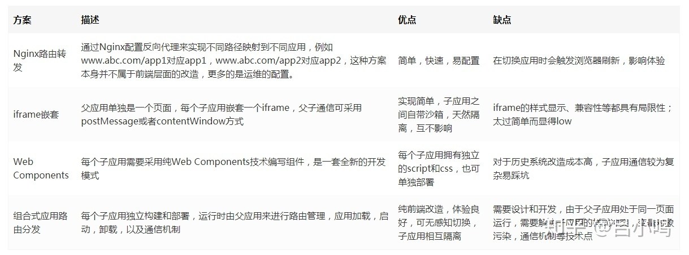

# 一面 6：开发环境相关知识点与高频考题解析

工程师的开发环境决定其开发效率，常用的开发环境配置也是面试考查点之一。

## 知识点梳理

*   IDE
*   Git
*   Linux 基础命令
*   前端构建工具
*   调试方法

本小节会重点介绍 Git 的基本用法、代码部署和开发中常用的 Linux 命令，然后以 webpack 为例介绍下前端构建工具，最后介绍怎么抓包解决线上问题。这些都是日常开发和面试中常用到的知识。

* * *

## IDE

> 题目：你平时都使用什么 IDE 编程？有何提高效率的方法？

前端最网看一下。
常用的 IDE 有 [Webstorm](https://www.jetbrains.com/webstorm/)、[Sublime](https://www.sublimetext.com/)、[Atom](https://atom.io/) 和 [VSCode](https://code.visualstudio.com/)，我们可以分别去它们的官
Webstorm 是最强大的编辑器，因为它拥有各种强大的插件和功能，但是我没有用过，因为它收费。不是我舍不得花钱，而是因为我觉得免费的 Sublime 已经够我用了。跟面试官聊到 Webstorm 的时候，没用过没事儿，但一定要知道它：第一，强大；第二，收费。

Sublime 是我日常用的编辑器，第一它免费，第二它轻量、高效，第三它插件非常多。用 Sublime 一定要安装各种插件配合使用，可以去网上搜一下“sublime”常用插件的安装以及用法，还有它的各种快捷键，并且亲自使用它。这里就不一一演示了，网上的教程也很傻瓜式。

Atom 是 GitHub 出品的编辑器，跟 Sublime 差不多，免费并且插件丰富，而且跟 Sublime 相比风格上还有些小清新。但是我用过几次就不用了，因此它打开的时候会比较慢，卡一下才打开。当然总体来说也是很好用的，只是个人习惯问题。

VSCode 是微软出品的轻量级（相对于 Visual Studio 来说）编辑器，微软做 IDE 那是出了名的好，出了名的大而全，因此 VSCode 也有上述 Sublime 和 Atom 的各种优点，但是我也是因为个人习惯问题（本人不愿意尝试没有新意的新东西），用过几次就不用了。

总结一下：

*   如果你要走大牛、大咖、逼格的路线，就用 Webstorm
*   如果你走普通、屌丝、低调路线，就用 Sublime
*   如果你走小清新、个性路线，就用 VSCode 或者 Atom
*   如果你面试，最好有一个用的熟悉，其他都会一点

最后注意：千万不要说你使用 Dreamweaver 或者 notepad++ 写前端代码，会被人鄙视的。如果你不做 .NET 也不要用 Visual Studio ，不做 Java 也不要用 Eclipse。

* * *

## Git

你此前做过的项目一定要用过 Git，而且必须是命令行，如果没用过，你自己也得恶补一下。对 Git 的基本应用比较熟悉的同学，可以跳过这一部分了。macOS 自带 Git，Windows 需要安装 Git 客户端，去 [Git 官网](https://git-scm.com/download/win) 下载即可。

国内比较好的 Git 服务商有 coding.net，国外有大名鼎鼎的 GitHub，但是有时会有网络问题，因此建议大家注册一个 coding.net 账号然后创建项目，来练练手。

> 题目：常用的 Git 命令有哪些？如何使用 Git 多人协作开发？

### 常用的 Git 命令

首先，通过`git clone <项目远程地址>`下载下来最新的代码，例如`git clone git@git.coding.net:username/project-name.git`，默认会下载`master`分支。

然后修改代码，修改过程中可以通过`git status`看到自己的修改情况，通过`git diff <文件名>`可查阅单个文件的差异。

最后，将修改的内容提交到远程服务器，做如下操作

```
git add .
git commit -m "xxx"
git push origin master

```

如果别人也提交了代码，你想同步别人提交的内容，执行`git pull origin master`即可。

### 如何多人协作开发

多人协作开发，就不能使用`master`分支了，而是要每个开发者单独拉一个分支，使用`git checkout -b <branchname>`，运行`git branch`可以看到本地所有的分支名称。

自己的分支，如果想同步`master`分支的内容，可运行`git merge master`。切换分支可使用`git checkout <branchname>`。

在自己的分支上修改了内容，可以将自己的分支提交到远程服务器

```
git add .
git commit -m "xxx"
git push origin <branchname>

```

最后，待代码测试没问题，再将自己分支的内容合并到`master`分支，然后提交到远程服务器。

```
git checkout master
git merge <branchname>
git push origin master

```

### 关于 SVN

关于 SVN 笔者的态度和针对 IE 低版本浏览器的态度一样，你只需要查询资料简单了解一下。面试的时候可能会问到，但你只要熟悉了 Git 的操作，面试官不会因为你不熟悉 SVN 而难为你。前提是你要知道一点 SVN 的基本命令，自己上网一查就行。

不过 SVN 和 Git 的区别你得了解。SVN 是每一步操作都离不开服务器，创建分支、提交代码都需要连接服务器。而 Git 就不一样了，你可以在本地创建分支、提交代码，最后再一起 push 到服务器上。因此，Git 拥有 SVN 的所有功能，但是却比 SVN 强大得多。（Git 是 Linux 的创始人 Linus 发明的东西，因此也倍得推崇。）

* * *

## Linux 基础命令

目前互联网公司的线上服务器都使用 Linux 系统，测试环境为了保证和线上一致，肯定也是使用 Linux 系统，而且都是命令行的，没有桌面，不能用鼠标操作。因此，掌握基础的 Linux 命令是非常必要的。下面总结一些最常用的 Linux 命令，建议大家在真实的 Linux 系统下亲自试一下。

关于如何得到 Linux 系统，有两种选择：第一，在自己电脑的虚拟机中安装一个 Linux 系统，例如 Ubuntu/CentOS 等，下载这些都不用花钱；第二，花钱去阿里云等云服务商租一个最便宜的 Linux 虚拟机。推荐第二种。一般正式入职之后，公司都会给你分配开发机或者测试机，给你账号和密码，你自己可以远程登录。

> 题目：常见 linux 命令有哪些？

### 登录

入职之后，一般会有现有的用户名和密码给你，你拿来之后直接登录就行。运行 `ssh name@server` 然后输入密码即可登录。

### 目录操作

*   创建目录 `mkdir <目录名称>`
*   删除目录 `rm <目录名称>`
*   定位目录 `cd <目录名称>`
*   查看目录文件 `ls` `ll`
*   修改目录名 `mv <目录名称> <新目录名称>`
*   拷贝目录 `cp <目录名称> <新目录名称>`

### 文件操作

*   创建文件 `touch <文件名称>` `vi <文件名称>`
*   删除文件 `rm <文件名称>`
*   修改文件名 `mv <文件名称> <新文件名称>`
*   拷贝文件 `cp <文件名称> <新文件名称>`

### 文件内容操作

*   查看文件 `cat <文件名称>` `head <文件名称>` `tail <文件名称>`
*   编辑文件内容 `vi <文件名称>`
*   查找文件内容 `grep '关键字' <文件名称>`

* * *

## 前端构建工具

构建工具是前端工程化中不可缺少的一环，非常重要，而在面试中却有其特殊性 —— **面试官会通过询问构建工具的作用、目的来询问你对构建工具的了解，只要这些你都知道，不会再追问细节**。因为，在实际工作中，真正能让你编写构建工具配置文件的机会非常少，一个项目就配置一次，后面就很少改动了。而且，如果是大众使用的框架（如 React、Vue 等），还会直接有现成的脚手架工具，一键创建开发环境，不用手动配置。

> 题目：前端为何要使用构建工具？它解决了什么问题？

### 何为构建工具

“构建”也可理解为“编译”，就是将开发环境的代码转换成运行环境代码的过程。**开发环境的代码是为了更好地阅读，而运行环境的代码是为了更快地执行，两者目的不一样，因此代码形式也不一样**。例如，开发环境写的 JS 代码，要通过混淆压缩之后才能放在线上运行，因为这样代码体积更小，而且对代码执行不会有任何影响。总结一下需要构建工具处理的几种情况：

*   **处理模块化**：CSS 和 JS 的模块化语法，目前都无法被浏览器兼容。因此，开发环境可以使用既定的模块化语法，但是需要构建工具将模块化语法编译为浏览器可识别形式。例如，使用 webpack、Rollup 等处理 JS 模块化。
*   **编译语法**：编写 CSS 时使用 Less、Sass，编写 JS 时使用 ES6、TypeScript 等。这些标准目前也都无法被浏览器兼容，因此需要构建工具编译，例如使用 Babel 编译 ES6 语法。
*   **代码压缩**：将 CSS、JS 代码混淆压缩，为了让代码体积更小，加载更快。

### 构建工具介绍

最早普及使用的构建工具是 [Grunt](http://www.gruntjs.net/) ，不久又被 [Gulp](https://www.gulpjs.com.cn/) 给追赶上。Gulp 因其简单的配置以及高效的性能而被大家所接受，也是笔者个人比较推荐的构建工具之一。如果你做一些简单的 JS 开发，可以考虑使用。

如果你的项目比较复杂，而且是多人开发，那么你就需要掌握目前构建工具届的神器 —— webpack 。不过神器也有一个缺点，就是学习成本比较高，需要拿出专门的时间来专心学习，而不是三言两语就能讲完的。我们下面就演示一下 webpack 最简单的使用，全面的学习还得靠大家去认真查阅相关文档，或者参考专门讲解 webpack 的教程。

### webpack 演示

接下来我们演示一下 webpack 处理模块化和混淆压缩代码这两个基本功能。

首先，你需要安装 Node.js，没有安装的可以去 [Node.js 官网](http://nodejs.cn/download/) 下载并安装。安装完成后运行如下命令来验证是否安装成功。

```
node -v
npm -v

```

然后，新建一个目录，进入该目录，运行`npm init`，按照提示输入名称、版本、描述等信息。完成之后，该目录下出现了一个`package.json`文件，是一个 JSON 文件。

接下来，安装 wepback，运行`npm i --save-dev webpack`，网络原因需要耐心等待几分钟。

接下来，编写源代码，在该目录下创建`src`文件夹，并在其中创建`app.js`和`dt.js`两个文件，文件内容分别是：

```
// dt.js 内容
module.exports = {
    getDateNow: function () {
        return Date.now()
    }
}

// app.js 内容
var dt = require('./dt.js')
alert(dt.getDateNow())

```

然后，再返回上一层目录，新建`index.html`文件（该文件和`src`属于同一层级），内容是

```
<!DOCTYPE html>
<html>
<head>
    <meta charset="UTF-8">
    <title>test</title>
</head>
<body>
    <div>test</div>
    
    <script src='./dist/bundle.js'></script>
</body>
</html>

```

然后，编写 webpack 配置文件，新建`webpack.config.js`，内容是

```

const path = require('path');
const webpack = require('webpack');
module.exports = {
  context: path.resolve(__dirname, './src'),
  entry: {
    app: './app.js',
  },
  output: {
    path: path.resolve(__dirname, './dist'),
    filename: 'bundle.js',
  },
  plugins: [
    new webpack.optimize.UglifyJsPlugin({
        compress: {
          //supresses warnings, usually from module minification
          warnings: false
        }
    }),
  ]
};

```

总结一下，目前项目的文件目录是：

```
src
  +-- app.js
  +-- dt.js
index.html
package.json
webpack.config.js
```

接下来，打开`package.json`，然后修改其中`scripts`的内容为：

```
  "scripts": {
    "start": "webpack"
  }

```

在命令行中运行`npm start`，即可看到编译的结果，最后在浏览器中打开`index.html`，即可弹出`Date.now()`的值。

### 总结

最后再次强调，**深刻理解构建工具存在的价值，比你多会一些配置代码更加有意义，特别是对于应对面试来说**。

### webpack原理
Webpack 的运行流程是一个串行的过程，从启动到结束会依次执行以下流程：

1. 初始化参数：从配置文件和 Shell 语句中读取与合并参数，得出最终的参数；
2. 开始编译：用上一步得到的参数初始化 Compiler 对象，加载所有配置的插件，执行对象的 run 方法开始执行编译；
3. 确定入口：根据配置中的 entry 找出所有的入口文件；
4. 编译模块：从入口文件出发，调用所有配置的 Loader 对模块进行编译，再找出该模块依赖的模块，再递归本步骤直到所有入口依赖的文件都经过了本步骤的处理；
5. 完成模块编译：在经过第4步使用 Loader 翻译完所有模块后，得到了每个模块被翻译后的最终内容以及它们之间的依赖关系；
6. 输出资源：根据入口和模块之间的依赖关系，组装成一个个包含多个模块的 Chunk，再把每个 Chunk 转换成一个单独的文件加入到输出列表，这步是可以修改输出内容的最后机会；
7. 输出完成：在确定好输出内容后，根据配置确定输出的路径和文件名，把文件内容写入到文件系统。

在以上过程中，Webpack 会在特定的时间点广播出特定的事件，插件在监听到感兴趣的事件后会执行特定的逻辑，并且插件可以调用 Webpack 提供的 API 改变 Webpack 的运行结果。

### webpack的loader和plugin有什么区别
- `loader` 
用于加载某些资源文件。因为 `webpack` 本身只能打包 `commonjs` 规范的 `js` 文件，

对于其他资源例如 `css`，图片，或者其他的语法集，比如 `jsx`， `coffee`，是没有办法加载的。 

这就需要对应的 `loader` 将资源转化，加载进来。

- `plugin` 
用于扩展 `webpack` 的功能。功能更加的丰富，不仅局限于资源的加载。

总结：`loader` 用于加载待打包的资源，`plugin` 用于扩展 `webpack`。

### Plugin的工作机制？
1. 一个 JavaScript 命名函数。
2. 在插件函数的 prototype 上定义一个 apply 方法。
3. 指定一个绑定到 webpack 自身的事件钩子。
4. 处理 webpack 内部实例的特定数据。
5. 功能完成后调用 webpack 提供的回调。
6. 插件是由「具有 apply 方法的 prototype 对象」所实例化出来的。这个 apply 方法在安装插件时，会被 webpack compiler 调用一次。apply 方法可以接收一个 webpack compiler 对象的引用，从而可以在回调函数中访问到 compiler 对象

### tree-shaking实现原理
概念：Tree-shaking的本质是消除无用的js代码。

实现原理可以简单的概况：

1. ES6 Module引入进行静态分析，故而编译的时候正确判断到底加载了那些模块
2. 静态分析程序流，判断那些模块和变量未被使用或者引用，进而删除对应代码

### webpack5的新特性
尝试用持久性缓存来提高构建性能。
尝试用更好的算法和默认值来改进长期缓存。
尝试用更好的 Tree Shaking 和代码生成来改善包大小。
尝试改善与网络平台的兼容性。
尝试在不引入任何破坏性变化的情况下，清理那些在实现 v4 功能时处于奇怪状态的内部结构。
试图通过现在引入突破性的变化来为未来的功能做准备，尽可能长时间地保持在 v5 版本上。
### webpack3到webpack4的速度提升

### 手写webpack的loader

### 手写webpack的plugin

## 调试方法

调试方法这块被考查最多的就是如何进行抓包。

> 题目：如何抓取数据？如何使用工具来配置代理？

PC 端的网页，我们可以通过 Chrome、Firefox 等浏览器自带的开发者工具来查看网页的所有网络请求，以帮助排查 bug。这种监听、查看网络请求的操作称为**抓包**。

针对移动端的抓包工具，Mac 系统下推荐使用 Charles 这个工具，首先 [下载](https://www.charlesproxy.com/download/) 并安装，打开。Windows 系统推荐使用 [Fiddler](http://rj.baidu.com/soft/detail/10963.html)，下载安装打开。两者使用基本一致，下面以 Charles 为例介绍。

接下来，将安装好 Charles 的电脑和要抓包的手机，连接到同一个网络（一般为公司统一提供的内网，由专业网络工程师搭建），保证 IP 段相同。然后，将手机设置网络代理（每种不同手机如何设置网络代理，网上都有傻瓜式教程），代理的 IP 为电脑的 IP，代理的端口为`8888`。然后，Charles 可能会有一个弹框提示是否允许连接代理，这里选择“允许”即可。这样，使用手机端访问的网页或者联网的请求，Charles 就能监听到了。

在开发过程中，经常用到抓包工具来做代理，将线上的地址代理到测试环境，Charles 和 Fiddler 都可实现这个功能。以 Charles 为例，点击菜单栏中 Tools 菜单，然后二级菜单中点击 Map Remote，会弹出配置框。首先，选中 Enable Map Remote 复选框，然后点击 Add 按钮，添加一个代理项。例如，如果要将线上的`https://www.aaa.com/api/getuser?name=xxx`这个地址代理到测试地址`http://168.1.1.100:8080/api/getuser?name=xxx`，配置如下图


## 前端架构
### 微前端
微前端（Micro-Frontends）是一种类似于微服务的架构，它将微服务的理念应用于浏览器端，即将 Web 应用由单一的单体应用转变为多个小型前端应用聚合为一的应用。各个前端应用还可以独立运行、独立开发、独立部署。微前端不是单纯的前端框架或者工具，而是一套架构体系，这个概念最早在2016年底被提出。

### 实现微前端有哪些方案


## 小程序的双线程模型
其实就是把逻辑层和渲染层分开，然后中间用 Navite 进行衔接。 而这个 Native 的存在是为了提高小程序的监控性和安全性考虑的。

### 小程序界面渲染整体流
1. 在渲染层，宿主环境会把 WXML 转化成对应的j s 对象；
2. 将 js 对象再次转成真实 DOM 树，交由渲染层线程渲染；
3. 数据变化时，逻辑层提供最新的变化数据，js 对象发生变化，进行 diff 算法对比；
4. 将最新变化的内容反映到真实的 DOM 树中，更新界面。

## imgcook
imgcook 是专注以各种图像（Sketch/PSD/静态图片）为原材料烹饪的匠心大厨，通过智能化手段将各种视觉稿一键生成可维护的前端代码，切实提高前端的开发效率。

* * *

## 小结

本小节总结了前端开发环境常考查的知识，这些知识也是前端程序员必须掌握的，否则会影响开发效率。