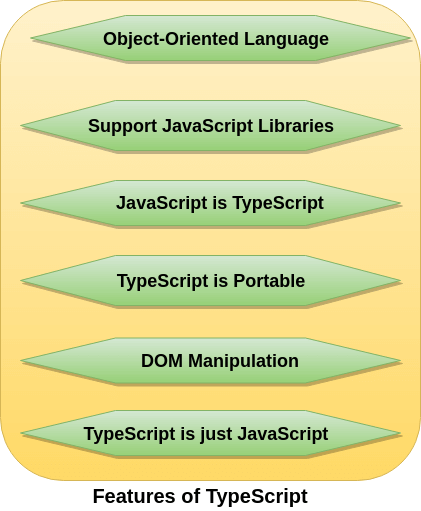

# awsome-knowledge-front-end
## 目录
### JavaScript
1. [什么是Typescript?](#什么是Typescript?)

## 题目

### JavaScript

1. ####  什么是Typescript?
TypeScript是一种由微软开发和维护的免费开源编程语言。它是一个强类型的JavaScript超集，可编译为纯JavaScript。它是一种用于应用级JavaScript开发的语言。对于熟悉c#、Java和所有强类型语言的开发人员来说，TypeScript非常容易学习和使用。

TypeScript可以在任何浏览器、主机和操作系统上执行。TypeScript不是直接在浏览器上运行的。它需要一个编译器来编译和生成JavaScript文件。TypeScript是带有一些附加特性的ES6 JavaScript版本。

2. ####  TypeScript和JavaScript有什么不同？
TypeScript与JavaScript的区别如下:

编号|	JavaScript|	TypeScript
--|--|--
1	|它是由网景公司在1995年开发的。	|它是2012年由安德斯·海尔斯伯格(Anders Hejlsberg)开发的。
2	|JavaScript源文件在”.js”扩展。	|TypeScript源文件是”.ts”扩展名。
3	|JavaScript不支持ES6。	|TypeScript 支持ES6。
4	|它不支持强类型或静态类型。	|它支持强类型或静态类型特性。
5	|它只是一种脚本语言。	|它支持面向对象的编程概念，如类、接口、继承、泛型等。
6	|JavaScript没有可选的参数特性。|	TypeScript有可选的参数特性。
7	|它是解释语言，这就是为什么它在运行时突出显示错误。	|它编译代码并在开发期间突出显示错误。
8	|JavaScript不支持模块。|	TypeScript支持模块。
9	|在这里，number和string是对象。|	在这里，number和string是接口。
10	|JavaScript不支持泛型。|	TypeScript支持泛型。

#### 3.我们为什么需要TypeScript？
- TypeScript快速、简单，最重要的是，容易学习。
- TypeScript支持面向对象的编程特性，比如类、接口、继承、泛型等等。
- TypeScript在编译时提供了错误检查功能。它将编译代码，如果发现任何错误，它将在运行脚本之前突出显示这些错误。
- TypeScript支持所有JavaScript库，因为它是JavaScript的超集。
- TypeScript通过使用继承来支持可重用性。
- TypeScript使应用程序开发尽可能的快速和简单，并且TypeScript的工具支持为我们提供了自动完成、类型检查和源文档。
- TypeScript支持最新的JavaScript特性，包括ECMAScript 2015。
- TypeScript提供了ES6的所有优点和更高的生产力。
- TypeScript支持静态类型、强类型、模块、可选参数等。

#### 4.列出Typescript的一些特性


#### 5.列出使用Typescript的一些优点?
- 它提供了可选静态类型的优点。在这里，Typescript提供了可以添加到变量、函数、属性等的类型。
- Typescript能够编译出一个能在所有浏览器上运行的JavaScript版本。
- TypeScript总是在编译时强调错误，而JavaScript在运行时指出错误。
- TypeScript支持强类型或静态类型，而这不是在JavaScript中。
- 它有助于代码结构。
- 它使用基于类的面向对象编程。
- 它提供了优秀的工具支持和智能感知，后者在添加代码时提供活动提示。
- 它通过定义模块来定义名称空间概念。

#### 6.Typescript的缺点是什么?
- TypeScript需要很长时间来编译代码。
- TypeScript不支持抽象类。
- 如果我们在浏览器中运行TypeScript应用程序，需要一个编译步骤将TypeScript转换成JavaScript。
- Web开发人员使用了几十年的JavaScript，而TypeScript不是都是新东西。
- 要使用任何第三方库，必须使用定义文件。并不是所有第三方库都有可用的定义文件。
- 类型定义文件的质量是一个问题，即如何确保定义是正确的?

#### 7.TypeScript的不同组件是什么?
TypeScript主要有三个组件。这些都是


- 语言language
该语言由新语法、关键字、类型注释等元素组成，允许我们编写TypeScript。

- 编译器compiler
TypeScript编译器是开源的、跨平台的，是用TypeScript编写的。它将用TypeScript编写的代码转换为JavaScript代码。它执行从TypeScript代码到JavaScript代码的解析和类型检查。它还可以帮助将不同的文件连接到单个输出文件，并生成源映射。

- 语言服务language service
语言服务提供信息，帮助编辑器和其他工具提供更好的辅助功能，如自动重构和智能感知。

#### 8.Typescript是谁开发的？
typescript是由Anders Hejlsberg开发的，他也是c#语言开发团队的核心成员之一。typescript于2012年10月1日发布，被标记为0.8版。它是由Microsoft在Apache 2许可下开发和维护的。它是为开发大型应用程序而设计的。

#### 9.说说安装Typescript的最低要求。或者我们如何获得TypeScript并安装它？
TypeScript可以通过npm (node .js包管理器)在node的帮助下进行安装和管理。要安装TypeScript，首先要确保npm安装正确，然后运行以下命令在系统上全局安装TypeScript。
```
$ npm install -g typescript  
```
它安装一个命令行代码“tsc”，它将进一步用于编译我们的Typescript代码。确保检查系统上安装的Typescript版本。

安装TypeScript需要以下步骤:
- 下载并运行节点的.msi安装程序。
- 输入命令“node -v”检查安装是否成功。
- 在终端窗口中输入以下命令安装Typescript: $ npm install -g Typescript

#### 10.列出在Typescript中的内置类型
在Typescript中，内置的数据类型也称为原始数据类型。这些数据如下所示。


数字类型: 用于表示数字类型值。TypeScript中的所有数字都存储为浮点值。

语法: let标识符:number = value;

字符串类型: 它表示存储为Unicode UTF-16代码的字符序列。我们通过将字符串括在单引号或双引号中来在脚本中包含字符串。

语法: let标识符:字符串= ” “;

布尔类型: 用于表示逻辑值。当我们使用布尔类型时，我们只得到真或假的输出。布尔值是一个真值，它指定条件是否为真。

语法: let标识符:bool =布尔值;

Null类型: Null表示值未定义的变量。不能直接引用空类型值本身。空类型没有用处，因为我们只能为它分配一个空值。

语法: let num: number = null;

未定义类型: 它是未定义字面量的类型。未定义的类型表示所有未初始化的变量。它是没有用的，因为我们只能分配一个未定义的值给它。这种内置类型是所有类型的子类型。

语法: let num: number =未定义;

Void类型: Void是不返回任何类型值的函数的返回类型。如果没有可用的数据类型，则使用它。

语法: let unusable:void =未定义;